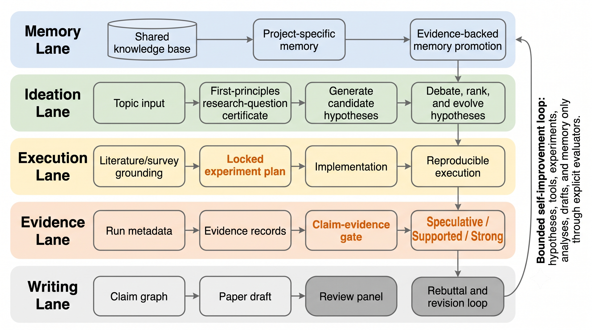

# RX — a self-improving ML/CS research pipeline

RX is a set of [Claude Code](https://claude.com/claude-code) / Codex skills that run an ML or
CS research project end to end — from a vague idea to a submitted paper — with every
intermediate step traced to disk and gated by evidence instead of asserted in prose.

It exists because AI research agents are good at producing fluent papers and bad at knowing
whether their claims are actually true. RX fixes that by refusing to let a claim into the
manuscript unless it can point to the evidence, experiment, and commit that back it up.

## The pipeline

```
rx-spinoff ─┐
rx-ideate ──┴─→ rx-survey → rx-grill → rx-plan → rx-experiment → rx-analyze → rx-write → rx-review
                          \__ rx-pipeline orchestrates all of it, with a self-improving --loop __/
```

Two cold-start entry points feed `rx-survey`:

- **`rx-ideate`** — turn a vague topic into sharp, novelty-checked research questions.
- **`rx-spinoff`** — turn an existing paper into a critique plus ranked follow-up directions,
  then auto-continue the pipeline (stopping at the plan lock before any compute is spent).

After survey, **`rx-grill`** runs a grill-me-style interview so you and the agent reach equal
understanding of the research design (question, novelty gap, metric, baselines, falsifiers)
before `rx-plan` locks the evaluation contract.

Invoke any stage by name ("use rx-plan to lock the metric for..."), or run `rx-pipeline` to
chain the whole thing, optionally with `--loop` so negative results feed the next hypothesis
instead of getting discarded.



## Why RX exists

- **Nothing is stated as fact without evidence.** Claims carry a strength
  (`speculative | supported | strong`) computed from linked evidence and experiment records —
  never asserted by the writing stage. A claim the gate doesn't certify renders as
  `[UNSUPPORTED]` in the paper, not as prose.
- **Negative results are fuel, not failures.** The research loop feeds a negative result back
  into the next hypothesis instead of quietly re-rolling until something works.
- **The trace is the artifact.** Every research question, locked plan, experiment run, evidence
  record, claim, and review round lives on disk under `.rx/` — not just in a chat transcript —
  so a claim can be traced back to exactly the file that justifies it.

## Quick start

```bash
# one-time: set up the shared knowledge base + shared venv
# also records the canonical research root (~/research or /mnt/c/Users/<you>/research)
bash scripts/kb-init.sh

# bootstrap a new research project under research/<topic>/<name>/
bash scripts/bootstrap.sh my-project-name --topic llm-agents

# then, inside Claude Code or Codex, from that project directory:
#   "use rx-ideate to explore <topic>"
#   "use rx-pipeline --loop to run the whole thing"
```

New projects always land in the research catalog tree:

```text
$RX_RESEARCH_ROOT/<topic>/<project-name>/
  code/  writings/  experiments/  publication/{arxiv,anon}/  .rx/
```

Topics: `llm-agents`, `llm-reasoning`, `llm-inference`, `recsys`, `multimodal`,
`dl-optimization`, `_archive`. Override the root with `RX_RESEARCH_ROOT` or by editing
`~/.rx-kb/research_root`.

Every project gets its own `.rx/` traceability tree, but shares one Python venv
(`~/.rx-kb/venv/`, override with `RX_VENV_DIR`) so `rx_state` and its dependencies are installed
once instead of once per project.

## Layout

- `skills/` — the ten stage skills (`rx-ideate`, `rx-survey`, `rx-grill`, `rx-plan`,
  `rx-experiment`, `rx-analyze`, `rx-write`, `rx-review`, `rx-pipeline`, `rx-spinoff`), each a
  `SKILL.md`.
- `shared/rx_state/` — the Python package the skills call: `schema` (artifact types), `gates`
  (evidence → claim-strength rules), `store` (state + artifact I/O), `survey`, `grill`,
  `planlock`, `capture`, `analysis`, `anonymize`, `reproduce`, `review`, `pipeline` (the stage
  machine and both loops), `style` (writing-style calibration from surveyed papers), `cleanup`
  (optional, confirmation-gated disk cleanup for checkpoints/logs).
- `scripts/` — `kb-init.sh` (shared knowledge base + venv) and `bootstrap.sh` (new project
  scaffold).
- `tests/` — pytest suite for `rx_state`.
- `AGENTS.md` — the dense, technical reference for how the pipeline actually works (loop
  semantics, gate thresholds, output artifacts). Start there if you're extending RX itself.

## What a run produces

`rx-write` emits four synchronized outputs from one source of truth: `publication/arxiv/` and
`publication/anon/` (LaTeX, the anon copy anonymity-linted for double-blind submission), `code/` +
`code/REPRODUCE.md`, and `blog/<slug>.md` — the blog post is drafted but never auto-published;
it always asks for confirmation first. Working notes that are not venue-locked live in `writings/`.

## Status

Early and actively evolving. Issues and PRs welcome.
